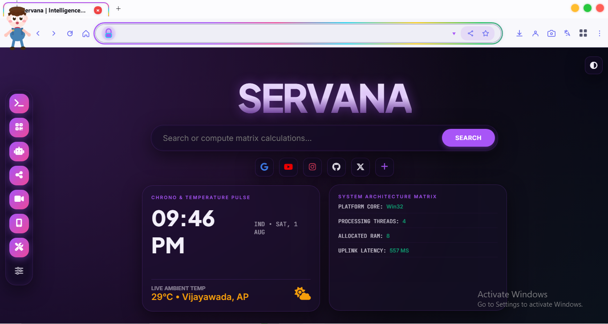

<div align="center">


<br /><br />

<a href="https://readme-typing-svg.demolab.com">
  
</a>

Built on C# 11.0, .NET 8.0 WinForms, and Microsoft WebView2 (Chromium) — Govinda Browser blends a modern browser, a full offline productivity suite, a hidden security vault, and 37 native HTML5 games into one lightweight Windows app.

<p>
  
  
  
  
</p>

<p>
  
  
  
  
</p>

<br />

<!-- 🔽 BIG DOWNLOAD BUTTON — replace YOUR_GOOGLE_DRIVE_LINK below with your real share link 🔽 -->
<a href="https://github.com/JaiServanaBhava/GovindaBrowser/releases/download/V1.0/Govinda.Browser.exe" target="_blank">
  
</a>

<sub>Windows 10/11 (64-bit) • ~2 GB installed • No sign-up required</sub>

<br /><br />

<p>
  <a href="#-installation">Install</a> •
  <a href="#-features">Features</a> •
  <a href="#-hidden-security-layer">Hidden Vault</a> •
  <a href="#-offline-games-hub">Games</a> •
  <a href="#-build-from-source">Build</a> •
  <a href="#-faq">FAQ</a>
</p>



</div>


## ✨ Why Govinda Browser

Most browsers are just network clients. Govinda Browser is a full desktop ecosystem:

| | |
|---|---|
| 🧩 **Uncompromised Local Autonomy** | Notes, App Installer, Timer, Download Manager, Voice Control — all native, no cloud required |
| 🔐 **Steganographic Vault System** | Sensitive files and hidden sessions cloaked behind everyday UI controls |
| ⚡ **Zero-Lag Native UI** | GDI+ double-buffered controls + Chromium-powered WebView2 rendering |
| 🧠 **Sandboxed Extension Engine** | Lightweight JS ↔ C# IPC bridge, no heavy Chrome API overhead |
| 🎮 **37 Offline Games** | A full HTML5 arcade bundled directly into the executable |


## 📦 Installation

<table>
<tr>
<td width="50%" valign="top">

### Standalone Installer

```
1. Run GovindaBrowser_Setup_v3.0.exe
2. Installs to %ProgramFiles%\Govinda Browser
3. Launch via Desktop Shortcut
```

</td>
<td width="50%" valign="top">

### Portable Package

```
1. Unzip GovindaBrowser_v3.0_Portable.zip
2. Extract to any folder or USB drive
3. Run GovindaBrowser.exe
```

</td>
</tr>
</table>

> **Requires:** [Microsoft WebView2 Runtime](https://developer.microsoft.com/microsoft-edge/webview2/) — pre-installed on most Windows 11 systems.

<br />

## 🖥️ System Requirements

| | Minimum | Recommended |
|---|---|---|
| **OS** | Windows 10 (64-bit) 1809+ | Windows 11 (64-bit) latest build |
| **CPU** | Dual-core 2.0 GHz | Quad-core 3.0 GHz |
| **RAM** | 2 GB | 8 GB+ |
| **Storage** | 500 MB free | 2 GB SSD |
| **Graphics** | DirectX 9 compatible | DirectX 11+ dedicated GPU |


## 🚀 Features

### Core Browsing

- **Multi-Tab Interface** — drag-and-drop reordering, pin/unpin, audio indicators
- **Smart Omnibox** — protocol detection, domain auto-complete, multi-engine search
- **Download Manager** — segmented downloads, bandwidth throttling, virus-scan hooks
- **History & Bookmarks** — encrypted JSON storage, fuzzy search, live favicons
- **Autofill Vault** — origin-scoped credential storage
- **Print to PDF** — native `PrintToPdfAsync` integration

### Privacy & Security

- **Ad & Tracker Blocking** — EasyList/AdGuard rule parsing via optimized `HashSet` + regex trie
- **Safe Search Lock** — enforced at the network-request level, can't be overridden client-side
- **Domain Restrictions** — admin-definable blocklists for domains, subnets, or keywords
- **Zero Telemetry** — 100% local processing, nothing leaves your machine

### Productivity Suite

| Tool | What it does |
|---|---|
| 📝 Scratchpad Notes | Auto-saving markdown/plain-text editor with encrypted export |
| ⏱️ Website Time Tracker | Per-domain usage charts with idle detection |
| 🎙️ Voice Navigation | Hands-free commands via `System.Speech.Recognition` |
| 🖼️ Image Replacer | Swaps heavy images for lightweight placeholders |
| 📥 App Installer | Checksum-verified `.msi`/`.exe` install queue |


## 🔒 Hidden Security Layer

Govinda Browser's logo doubles as a covert access gesture, tracked to the millisecond.

```
Double-click logo  →  Secret Calculator  →  enter passcode + "="  →  isolated RAM-only browsing session
Triple-click logo  →  Digital Locker     →  master password        →  AES-256-GCM encrypted file vault
```

- **Secret Calculator** — a fully working calculator that also unlocks a hidden, volatile browsing session (zero disk writes, no history/cookies/cache).
- **Digital Locker** — drag-and-drop file encryption with AES-256-GCM, SHA-512 salted auth, and zero-knowledge recovery (lose the password, lose the data — by design).

```
Ciphertext = AES-256-GCM( Data, PBKDF2(Passphrase, Salt, 100,000 iterations) )
```

<br />

## 🧩 Extension Engine

A lightweight JS ↔ C# runtime that skips the overhead of the full Chrome Extension API.

```js
// Example: extension → native host
window.chrome.webview.postMessage({
  extensionId: "dark-mode-pro",
  action: "TOGGLE_DARK_MODE",
  payload: { enabled: true }
});
```

**Built in:** AdBlocker Pro · Auto Refresher · Dark Mode Injector · Page Reader · Custom CSS/JS Inject · Password Generator · Snipping Tool · Resource Saver


## 🎮 Offline Games Hub

37 native HTML5 games, bundled offline, launched via `govinda://games`.

<details>
<summary><b>View all 37 titles</b></summary>
<br />

| Arcade Classics | Puzzle & Brain | Action & Skill |
|---|---|---|
| 2048 | Sudoku Classic | Flappy Bird Clone |
| Snake Retro | Tic Tac Toe AI | Pac-Man HTML5 |
| Pong Classic | Minesweeper | Space Invaders |
| Tetris HTML5 | Memory Card Match | Brick Breaker |
| Asteroids | Sliding Puzzle | Doodle Jump Clone |

| Strategy & Cards | Casual & Sports | Word & Math |
|---|---|---|
| Solitaire Classic | Mini Golf 2D | Wordle Offline |
| FreeCell | Table Tennis | Speed Math Challenge |
| Chess vs Engine | Archery Master | Hangman Game |
| Checkers | Air Hockey 2D | Typing Speed Tester |
| Connect Four | Penalty Kick | Simon Says |

| Simulations | Board Games | Arcade Extra |
|---|---|---|
| Flappy Helicopter | Backgammon | Frogger HTML5 |
| Tower Stacker | Ludo Offline | Pinball Classic |
| Breakout Pro | Battleship 2D | HexGL 3D Racing |

</details>

<br />

## 📊 How It Compares

| | Chrome | Edge | Brave | **Govinda Browser** |
|---|:---:|:---:|:---:|:---:|
| Engine | Chromium | Chromium | Chromium | WebView2 + .NET Shell |
| Offline productivity suite | ❌ | Limited | ❌ | ✅ Full native suite |
| Hidden vault system | ❌ | ❌ | ❌ | ✅ Steganographic |
| Offline HTML5 games | Dino only | Surf only | ❌ | ✅ 37 games |
| Telemetry | Extensive | Enterprise | Minimal | **Zero** |
| Memory (5 tabs) | ~850 MB | ~780 MB | ~650 MB | **~380 MB** |

<br />

## 🏗️ Architecture

```
                          GOVINDA DESKTOP SHELL
                       (C# .NET 8.0 WinForms Host UI)
        ┌───────────┬────────────┬─────────────┬────────────┐
        ▼           ▼            ▼             ▼            ▼
   Tab Manager  Security &  Hidden Gesture  Extension    Tool Suite
                AdBlocker    Dispatcher      Engine       Runtime
        └───────────┴────────────┴─────────────┴────────────┘
                                  ▼
                MICROSOFT WEBVIEW2 RUNTIME LAYER
                  (Chromium Engine / Process Sandbox)
```

Each tab runs on an isolated WebView2 process tree — a crash in one SPA never takes down the host. Background tabs are automatically throttled, then discarded to disk-serialized JSON after 30 minutes idle.


## 🔨 Build from Source

**Prerequisites:** Visual Studio 2022 (17.8+) with .NET Desktop Development workload, .NET 8.0 SDK

```bash
# Clone and open
git clone https://github.com/yourusername/govinda-browser.git
cd govinda-browser

# Restore dependencies
dotnet restore

# Build (Release)
dotnet build --configuration Release

# Run
./src/GovindaBrowser/bin/Release/net8.0-windows/GovindaBrowser.exe
```

<br />

## 📁 Repository Structure

```
govinda-browser/
├── docs/                       # Architectural specs & API docs
├── src/
│   ├── GovindaBrowser/
│   │   ├── Core/                # WebView2 wrappers & browser mechanics
│   │   ├── Security/            # Encryption & gesture detection engine
│   │   ├── Extensions/          # Plugin runtime & built-in extensions
│   │   ├── Tools/                # Offline productivity utilities
│   │   ├── UI/                   # Custom GDI+ controls & animation core
│   │   ├── Program.cs
│   │   └── FormMain.cs
│   └── Govinda.Games/            # 37 offline HTML5 game bundles
├── GovindaBrowser.sln
└── README.md
```

<br />

## ❓ FAQ

<details>
<summary><b>How do I reopen the Secret Calculator?</b></summary>
<br />
Double-click the Govinda Browser logo in the top-left of the header bar.
</details>

<details>
<summary><b>Where is Digital Locker data stored?</b></summary>
<br />
Locally at <code>%LocalAppData%\GovindaBrowser\Vault\</code>, encrypted with AES-256. It never leaves your machine.
</details>

<details>
<summary><b>Can I install third-party extensions?</b></summary>
<br />
Yes — drop JS/CSS-based extensions into the local extensions folder; Govinda's lightweight engine picks them up automatically.
</details>

<br />

## 🗺️ Roadmap

- [ ] End-to-end encrypted profile sync (`CloudSyncProvider.cs`)
- [ ] Built-in Tor routing proxy for private windows (`TorProxyBridge.cs`)
- [ ] WebGPU hardware renderer toggle (`GpuSettings.cs`)

<br />

## 🔐 Security & Privacy

All browsing, vault, and processing operations run **100% locally**. No telemetry, browsing history, or vault credentials are ever transmitted off-device.

<br />

<div align="center">

<a href="https://github.com/JaiServanaBhava/GovindaBrowser/releases/download/V1.0/Govinda.Browser.exe" target="_blank">
  
</a>

<br /><br />

**Govinda Browser** — Designed for Security, Speed, and Local Autonomy.

Proprietary / Standalone Desktop Suite. All rights reserved.

</div>


